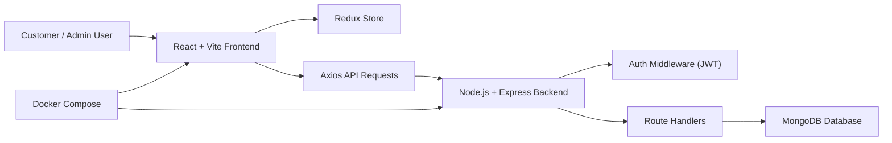
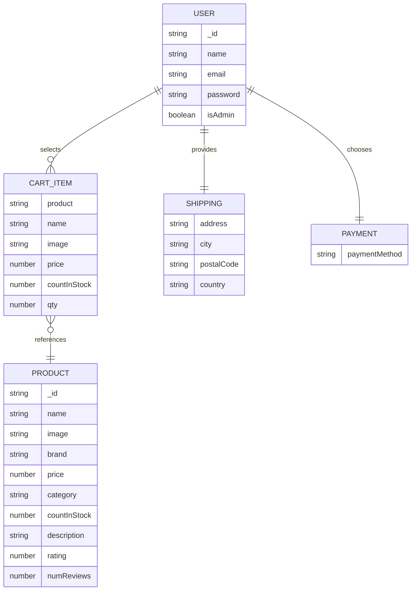
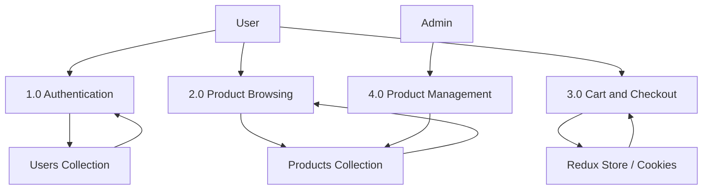
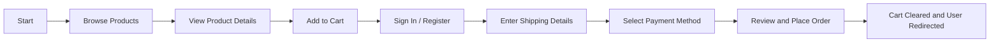
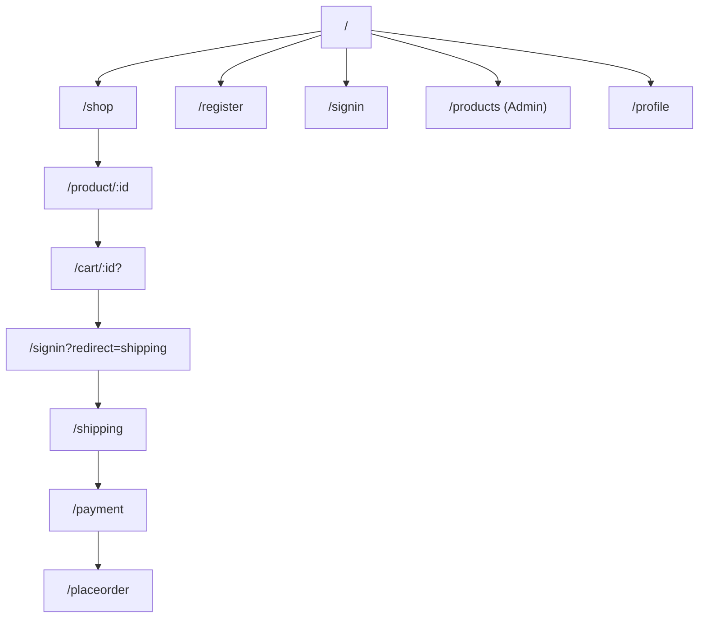
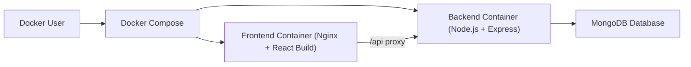

# ORIGAMI MARKETPLACE - E-COMMERCE WEBSITE

## A Detailed Project Report

Submitted in partial fulfillment of the requirements for the award of the degree of  
**Bachelor of Technology**

in

**Computer Science and Engineering**

Submitted by  
**Kumar Nirupam**  
Enrollment No.: __________________

Under the Guidance of  
**Project Guide Name:** __________________  
**Designation:** __________________

**Department of Computer Science and Engineering**  
**College / University Name:** __________________  
**Academic Session:** 2025-2026

\newpage

# DECLARATION

I hereby declare that the project report entitled **"Origami Marketplace - E-commerce Website"** submitted by me in partial fulfillment of the requirements for the award of the degree of Bachelor of Technology in Computer Science and Engineering is a record of original work carried out by me under the guidance of the concerned faculty supervisor. To the best of my knowledge, this work has not been submitted in part or in full to any other university or institution for the award of any degree, diploma, or similar academic qualification.

I further declare that all sources of information used in the preparation of this report have been duly acknowledged and referenced appropriately. The design, implementation, analysis, and documentation presented in this report are based on the actual development of the project and have been compiled with due academic integrity and professional responsibility.

Place: __________________  
Date: __________________

Signature of Student  
**Kumar Nirupam**

\newpage

# CERTIFICATE

This is to certify that the project report entitled **"Origami Marketplace - E-commerce Website"** submitted by **Kumar Nirupam** to the Department of Computer Science and Engineering in partial fulfillment of the requirements for the award of the degree of Bachelor of Technology is a bona fide record of work carried out under my supervision and guidance during the academic session 2025-2026.

The work presented in this report is found to be satisfactory in scope, quality, and technical depth for submission as a B.Tech project report. The candidate has demonstrated a clear understanding of full-stack web application development, software design principles, database integration, and container-based deployment practices while carrying out the work.

Signature of Project Guide: __________________  
Name of Project Guide: __________________  
Designation: __________________  
Department: Computer Science and Engineering

Signature of Head of Department: __________________  
Name of HOD: __________________

\newpage

# ABSTRACT

The rapid growth of digital commerce has created strong demand for scalable, user-friendly, and secure online shopping platforms that can serve both customers and administrators efficiently. The project **"Origami Marketplace - E-commerce Website"** has been developed as a full-stack web application to address this requirement by delivering a modern online marketplace that supports user registration, authentication, product browsing, product detail visualization, shopping cart management, multi-step checkout, and administrative product management. The project follows a modular architecture based on the MERN ecosystem, combining a React and Vite powered frontend with a Node.js and Express backend, while MongoDB is used for persistence of core entities such as users and products.

The frontend of the system has been designed to provide a responsive and interactive shopping experience. It includes a dedicated landing page, product listing interface, category filters, rating-based and price-based filtering, product detail pages, cart management, customer registration and sign-in flows, shipping and payment forms, and a final order placement screen. State management is handled through Redux, while browser cookies are used to preserve cart contents and user session information. On the server side, RESTful APIs are implemented for authentication, product retrieval, product creation, product update, and product deletion. JSON Web Token based authorization has been used to protect administrator-only operations.

The project also emphasizes practical software deployment by replacing cloud-centric deployment approaches with a Docker-based containerization strategy. Separate Dockerfiles have been used for the frontend and backend, while Docker Compose coordinates multi-container execution. The frontend is served through Nginx and proxies API requests to the Express backend, enabling an integrated runtime environment. The report presents the complete academic documentation of the project including literature study, architecture, methodology, implementation details, database analysis, API design, testing discussion, deployment workflow, conclusions, limitations, and future scope.

Keywords: E-commerce, MERN Stack, React, Node.js, Express, MongoDB, Redux, JWT, Docker, Nginx

\newpage

# ACKNOWLEDGMENT

I express my sincere gratitude to my project guide, faculty members, and the Department of Computer Science and Engineering for their valuable guidance, encouragement, and support throughout the development of this project report entitled **"Origami Marketplace - E-commerce Website."** Their academic direction and constructive suggestions helped in shaping both the technical implementation and the documentation of the project.

I would also like to thank my institution for providing the learning environment, resources, and technical exposure necessary to undertake a full-stack web development project of this nature. The opportunity to apply concepts from software engineering, database management systems, computer networks, web technologies, and deployment practices in a single integrated project has been highly enriching.

Finally, I am grateful to my family, peers, and well-wishers for their continuous motivation and support during the completion of the project. Their encouragement played an important role in maintaining consistency and dedication throughout the design, implementation, testing, and report writing phases.

\newpage

# TABLE OF CONTENTS

1. [Introduction](#chapter-1-introduction)  
2. [Literature Study](#chapter-2-literature-study)  
3. [System Design and Architecture](#chapter-3-system-design-and-architecture)  
4. [Methodology and Implementation](#chapter-4-methodology-and-implementation)  
5. [Experimental Results and Discussion](#chapter-5-experimental-results-and-discussion)  
6. [Deployment](#chapter-6-deployment)  
7. [Conclusion and Future Scope](#chapter-7-conclusion-and-future-scope)  
8. [References](#references)

\newpage

# LIST OF FIGURES

Figure 1. Overall system architecture of Origami Marketplace  
Figure 2. Entity relationship representation of the application data model  
Figure 3. Level-0 data flow diagram of the platform  
Figure 4. Customer workflow from browsing to checkout  
Figure 5. Frontend route and interaction flow  
Figure 6. Docker-based deployment topology  
Figure 7. Home page screenshot  
Figure 8. Product details page screenshot  
Figure 9. Cart page screenshot  
Figure 10. Registration page screenshot  
Figure 11. Admin product management screenshot

\newpage

# LIST OF TABLES

Table 1. Core objectives of the proposed system  
Table 2. Technology stack used in the project  
Table 3. Functional requirements of the system  
Table 4. Non-functional requirements of the system  
Table 5. Frontend modules and responsibilities  
Table 6. Backend modules and responsibilities  
Table 7. Database schema summary  
Table 8. User collection schema details  
Table 9. Product collection schema details  
Table 10. Logical cart and checkout data structure  
Table 11. API endpoint specification  
Table 12. Test cases and observed results  
Table 13. Docker deployment components

\newpage

# LIST OF ABBREVIATIONS

| Abbreviation | Full Form |
|---|---|
| API | Application Programming Interface |
| CSS | Cascading Style Sheets |
| DFD | Data Flow Diagram |
| ER | Entity Relationship |
| HTML | HyperText Markup Language |
| HTTP | HyperText Transfer Protocol |
| JWT | JSON Web Token |
| MERN | MongoDB, Express, React, Node.js |
| REST | Representational State Transfer |
| SPA | Single Page Application |
| UI | User Interface |
| UX | User Experience |
| URL | Uniform Resource Locator |
| JSON | JavaScript Object Notation |
| CRUD | Create, Read, Update, Delete |
| ODM | Object Document Mapper |

\newpage

# CHAPTER 1 INTRODUCTION

## 1.1 Introduction

Electronic commerce has emerged as one of the most influential domains in modern computing, transforming the way customers discover, evaluate, and purchase products. Traditional retail models are increasingly complemented or replaced by digital platforms that provide greater reach, convenience, and personalization. In this context, full-stack web applications have become essential for enabling efficient online business operations, secure customer interaction, and streamlined product administration.

The project **"Origami Marketplace - E-commerce Website"** is conceived as a practical implementation of a modern online shopping platform. It is designed to support core e-commerce functionality including customer registration, authentication, browsing of products, viewing product descriptions, filtering and categorizing products, managing a shopping cart, performing a guided checkout process, and allowing administrative control over product inventory. The system has been implemented using the MERN technology stack, which offers a robust and widely accepted foundation for scalable web application development.

The project also reflects current software development practices by incorporating component-based frontend design, REST API communication, JWT-based authorization, cookie-backed session persistence, and containerized deployment using Docker. Together, these characteristics make the project academically meaningful and practically relevant for study in software engineering and web technologies.

## 1.2 Background of the Problem

Conventional shopping platforms often suffer from limitations such as poor user experience, limited product discoverability, fragmented user flows, and inadequate support for both customers and administrators. Small or custom-built digital storefronts may also lack a maintainable architecture that separates frontend concerns, backend logic, and deployment configuration in a structured manner.

The need for an academic project in this domain lies not merely in recreating a storefront, but in understanding how multiple software layers interact. An e-commerce platform must combine presentation logic, business rules, authentication, data persistence, routing, state management, and deployment strategy into a coherent system. This complexity makes it an appropriate case study for a B.Tech major project.

## 1.3 Problem Statement

The problem addressed by this project is the design and development of a modular, user-friendly, and secure e-commerce website that can:

- allow users to register and sign in,
- display products in an organized and filterable format,
- provide detailed product information,
- maintain cart state across sessions,
- guide customers through a checkout process,
- provide authenticated administrative control over product data, and
- support consistent execution through Docker containerization.

The challenge is to implement these functions in an integrated manner while maintaining code modularity, API clarity, and a deployment model that is reproducible across environments.

## 1.4 Objectives of the Project

The major objectives of the project are presented in Table 1.

| Objective No. | Objective Description |
|---|---|
| 1 | To design and develop a responsive e-commerce frontend for customers and administrators. |
| 2 | To implement a backend API for user authentication and product management. |
| 3 | To integrate MongoDB for persistent storage of user and product information. |
| 4 | To provide a structured cart and checkout flow using Redux and client-side persistence. |
| 5 | To secure protected product management operations using JWT-based authentication and role validation. |
| 6 | To containerize the complete application using Docker and Docker Compose. |
| 7 | To document the system in a formal academic style consistent with a B.Tech project report. |

## 1.5 Scope of the Project

The scope of Origami Marketplace includes the complete implementation of a customer-facing storefront and a restricted administrator module for product management. The application supports product browsing, category filtering, price filtering, rating filtering, inventory-aware cart management, sign-in and registration flows, shipping and payment forms, and a final place-order interface. The project also includes a backend service connected to MongoDB for user and product data persistence.

The scope does not presently extend to persistent order storage, payment gateway integration, search indexing, recommendation engines, analytics dashboards, review submission APIs, or real-time order tracking. These represent future directions rather than implemented features.

## 1.6 Significance of the Project

This project is significant from both educational and practical perspectives. Educationally, it demonstrates the integration of multiple subjects such as web technologies, database management systems, software engineering, information security, and DevOps fundamentals. Practically, it results in a usable prototype of an online retail system that reflects real-world design patterns used in modern web applications.

## 1.7 Organization of the Report

The report is organized into seven major chapters. Chapter 1 introduces the project and establishes objectives and scope. Chapter 2 presents the literature study and conceptual foundation of e-commerce systems and the MERN ecosystem. Chapter 3 explains system design and architecture with diagrams and data representations. Chapter 4 discusses the methodology and implementation of the project in detail. Chapter 5 covers results, testing observations, and discussion. Chapter 6 explains Docker-based deployment. Chapter 7 concludes the work and outlines future enhancements. The report ends with references.

\newpage

# CHAPTER 2 LITERATURE STUDY

## 2.1 Introduction

The literature study provides the conceptual and technological background necessary to understand the design choices made in Origami Marketplace. An e-commerce platform involves concerns such as usability, security, maintainability, scalability, and transaction support. Modern web engineering literature emphasizes decoupled architectures, RESTful communication, modular interfaces, and deployment automation as key enablers of maintainable online systems.

## 2.2 Evolution of E-commerce Systems

E-commerce systems have evolved from static catalog websites into dynamic, personalized, and transaction-oriented platforms. Early systems focused on displaying product information with minimal interactivity, while contemporary applications emphasize responsive interfaces, session continuity, search and filtering, recommendation support, and secure payment workflows. This evolution has been made possible by the growth of JavaScript frameworks, API-driven backend services, document databases, and containerized deployment infrastructure.

In the context of academic implementation, the most useful pattern is the separation of presentation, business logic, and persistence layers. This separation improves maintainability and allows the application to evolve in stages without rewriting the entire codebase.

## 2.3 Review of Frontend Technologies

React has become one of the most widely used frontend libraries for building interactive single-page applications. It enables component-based development, reusable UI blocks, declarative rendering, and efficient state updates. In Origami Marketplace, React is used to define screens such as the landing page, home page, product details page, cart page, checkout screens, and admin product management screen.

The use of Vite as the frontend build tool provides lightweight development setup and modern bundling support. React Router is used to enable navigation between multiple application screens, while Redux centralizes shared application state such as product lists, current user information, and cart contents.

## 2.4 Review of Backend Technologies

Node.js enables server-side JavaScript execution and is widely used for API development. Express.js, built on top of Node.js, offers a compact yet powerful framework for building REST APIs. For an e-commerce application, Express is well suited for organizing routes, parsing JSON requests, attaching middleware, and handling authentication logic.

MongoDB is used as the database in this project. Its document-oriented model aligns well with JavaScript-driven applications and supports flexible schema design. Mongoose serves as the ODM layer that defines user and product schemas, provides validation, and simplifies query handling.

## 2.5 Authentication and Session Handling in Web Applications

User authentication is a central requirement of e-commerce platforms because it protects personal data and administrative actions. JSON Web Tokens are commonly used in stateless authentication architectures. Once a user signs in, a token is generated by the server and then stored on the client side. This token is sent with protected requests and verified by middleware on the backend.

In the present project, JWT-based authentication is implemented for secured product creation, update, and deletion. Role-based authorization is layered on top of authentication through an administrator check, ensuring that only authorized users can access product management operations.

## 2.6 Shopping Cart and Checkout Models

The shopping cart is a fundamental element of all e-commerce systems. It serves as a temporary holding area for selected items and often includes quantity updates, item removal, shipping information, payment preferences, and subtotal calculations. In large commercial systems, cart data is frequently stored server-side. However, for lightweight applications and academic prototypes, client-side storage combined with centralized state management is a practical solution.

Origami Marketplace follows this academic prototype approach by using Redux for cart state and browser cookies for persistence. Shipping and payment details are also maintained in application state during the checkout sequence.

## 2.7 Containerization in Modern Software Deployment

Traditional deployment often suffers from environment inconsistencies, dependency conflicts, and manual setup complexity. Docker addresses these issues by packaging applications and their dependencies into portable containers. Docker Compose extends this model by orchestrating multiple services together, making it suitable for full-stack applications with independent frontend and backend components.

In this project, Docker is used not as an optional add-on but as a structured deployment chapter replacing cloud deployment. The backend is packaged in a Node.js container, the frontend is built and served through Nginx, and Docker Compose coordinates both services over a bridge network.

## 2.8 Research Gap and Relevance to the Present Work

Many tutorials and example implementations of e-commerce systems either focus primarily on the frontend or demonstrate backend APIs without sufficient attention to user flow and deployment. Similarly, some academic reports remain theoretical and do not map documented chapters to actual source code structure. The present work addresses this gap by documenting a real implementation with explicit correspondence to routes, screens, models, reducers, actions, middleware, and Docker artifacts used in the project.

## 2.9 Summary

The literature study establishes that modern e-commerce platforms benefit from componentized frontend development, RESTful backend services, document-based persistence, JWT-secured APIs, and container-based deployment. These findings directly inform the architecture and implementation of Origami Marketplace.

\newpage

# CHAPTER 3 SYSTEM DESIGN AND ARCHITECTURE

## 3.1 Introduction

System design is the stage where functional requirements are translated into a structured architecture. For Origami Marketplace, the design objective was to maintain a clean separation between user interface, business logic, data storage, and deployment concerns. The result is a layered full-stack architecture that can be understood, extended, and maintained with clarity.

## 3.2 Overall System Architecture

The application follows a three-tier logical structure:

- Presentation layer: React frontend with routed screens and Redux-managed state.
- Application layer: Node.js and Express backend exposing REST APIs.
- Data layer: MongoDB accessed through Mongoose models.

Figure 1 represents the overall architecture.



**Figure 1. Overall system architecture of Origami Marketplace**

## 3.3 Technology Stack

Table 2 summarizes the technology stack used in the project.

| Layer | Technology | Purpose |
|---|---|---|
| Frontend | React 18 | Component-based user interface |
| Frontend Build Tool | Vite | Fast development and production build process |
| Routing | React Router DOM | Client-side routing between screens |
| State Management | Redux, Redux Thunk | Centralized application state and async actions |
| HTTP Client | Axios | Communication with backend APIs |
| Styling | CSS, Bootstrap, React-Bootstrap | UI presentation and carousel support |
| Backend Runtime | Node.js | Server-side JavaScript execution |
| Backend Framework | Express.js | REST API development |
| Database | MongoDB | Persistence of users and products |
| ODM | Mongoose | Schema definition and database access |
| Authentication | JSON Web Token | User authentication and authorization |
| Session Persistence | js-cookie | Storage of user and cart data on client side |
| Web Server | Nginx | Serving frontend build and proxying API calls |
| Containerization | Docker, Docker Compose | Packaging and orchestrating services |

## 3.4 Functional Requirements

The functional requirements of the system are listed in Table 3.

| Requirement ID | Functional Requirement |
|---|---|
| FR1 | The system shall allow a new user to register. |
| FR2 | The system shall allow an existing user to sign in. |
| FR3 | The system shall display products retrieved from the backend API. |
| FR4 | The system shall display product details for a selected item. |
| FR5 | The system shall allow users to add products to cart with quantity selection. |
| FR6 | The system shall allow users to update or remove cart items. |
| FR7 | The system shall collect shipping information from the customer. |
| FR8 | The system shall collect payment method selection from the customer. |
| FR9 | The system shall present a final order summary before order placement. |
| FR10 | The system shall restrict product creation, update, and deletion to admin users. |
| FR11 | The system shall provide a categorized and filterable product browsing interface. |
| FR12 | The system shall support containerized execution using Docker. |

## 3.5 Non-Functional Requirements

Table 4 summarizes important non-functional requirements.

| Requirement ID | Non-Functional Requirement |
|---|---|
| NFR1 | The application should be easy to navigate and responsive in layout. |
| NFR2 | Protected operations should require verified authentication tokens. |
| NFR3 | The system should use modular code organization for maintainability. |
| NFR4 | The platform should support reproducible deployment using containers. |
| NFR5 | The frontend should preserve key session data across refreshes using cookies. |
| NFR6 | APIs should return consistent JSON responses and status codes. |

## 3.6 Frontend Design

The frontend is organized around routed screens and shared components. The principal screens include:

- `LandingScreen`: promotional home entry with featured products and category shortcuts.
- `HomeScreen`: full marketplace listing with category, price, rating, and stock filters.
- `ProductScreen`: product details and quantity selection.
- `CartScreen`: cart item listing, subtotal calculation, and checkout initiation.
- `SigninScreen` and `RegisterScreen`: authentication and account creation flows.
- `ShippingScreen`, `PaymentScreen`, `PlaceOrderScreen`: sequential checkout process.
- `ProductsScreen`: admin product management interface.
- `ProfileScreen`: authenticated user information display.

Table 5 provides a structured frontend module summary.

| Frontend Module | Responsibility |
|---|---|
| `App.jsx` | Defines overall layout, header, sidebar, footer, and route map |
| `screens/LandingScreen.jsx` | Promotional entry page and featured product view |
| `screens/HomeScreen.jsx` | Product catalog with filtering and sorting |
| `screens/ProductScreen.jsx` | Product details and add-to-cart flow |
| `screens/CartScreen.jsx` | Cart management and subtotal calculation |
| `screens/SigninScreen.jsx` | User login |
| `screens/RegisterScreen.jsx` | New account registration |
| `screens/ShippingScreen.jsx` | Shipping data collection |
| `screens/PaymentScreen.jsx` | Payment option selection |
| `screens/PlaceOrderScreen.jsx` | Checkout summary and final action |
| `screens/ProductsScreen.jsx` | Admin product CRUD interface |
| `components/CheckoutSteps.jsx` | Visual checkout progress indicator |
| `components/Corousel.jsx` | Promotional image carousel |
| `components/Rating.jsx` | Star-based rating display |

## 3.7 Backend Design

The backend exposes route modules for product and user operations. Middleware functions are used to validate authentication and administrator role. Mongoose models define the document structures for core entities.

Table 6 summarizes the backend modules.

| Backend Module | Responsibility |
|---|---|
| `server.js` | Express server setup, MongoDB connection, route registration |
| `routes/userRoute.js` | Sign-in, registration, and admin creation routes |
| `routes/productRoute.js` | Product listing, details, create, update, delete routes |
| `models/userModel.js` | MongoDB schema for user documents |
| `models/productModel.js` | MongoDB schema for product documents |
| `util.js` | JWT generation, authentication middleware, admin middleware |
| `config.js` | MongoDB URL and JWT secret configuration |

## 3.8 Database Design

The persistent data layer currently includes two implemented MongoDB collections: `users` and `products`. The checkout flow uses client-side cart, shipping, and payment state, and the final order step does not yet create a persistent order document. Therefore, the database analysis in this report distinguishes between implemented collections and logical application-level structures.

Table 7 summarizes this distinction.

| Data Entity | Persistence Type | Status in Current Project |
|---|---|---|
| Users | MongoDB collection | Implemented |
| Products | MongoDB collection | Implemented |
| Cart | Redux state + browser cookies | Implemented client-side only |
| Shipping Info | Redux state | Implemented client-side only |
| Payment Method | Redux state | Implemented client-side only |
| Orders | Backend collection/API | Not implemented in current version |

### 3.8.1 User Schema

| Field Name | Data Type | Constraint | Description |
|---|---|---|---|
| `name` | String | Required | Full name of the user |
| `email` | String | Required, Unique | Login identifier |
| `password` | String | Required | User password as stored by current implementation |
| `isAdmin` | Boolean | Required, Default `false` | Administrator role indicator |

**Table 8. User collection schema details**

### 3.8.2 Product Schema

| Field Name | Data Type | Constraint | Description |
|---|---|---|---|
| `name` | String | Required | Product title |
| `image` | String | Required | Product image URL |
| `brand` | String | Required | Product brand |
| `price` | Number | Required, Default `0` | Selling price |
| `category` | String | Required | Product category |
| `countInStock` | Number | Required, Default `0` | Available stock count |
| `description` | String | Required | Product description |
| `rating` | Number | Required, Default `0` | Rating value |
| `numReviews` | Number | Required, Default `0` | Review count |

**Table 9. Product collection schema details**

### 3.8.3 Logical Cart and Checkout Data

| Structure | Key Fields | Storage Location | Purpose |
|---|---|---|---|
| Cart Item | `product`, `name`, `image`, `price`, `countInStock`, `qty` | Redux + cookies | Maintains selected products |
| Shipping | `address`, `city`, `postalCode`, `country` | Redux state | Delivery information |
| Payment | `paymentMethod` | Redux state | Checkout payment selection |

**Table 10. Logical cart and checkout data structure**

## 3.9 Entity Relationship Representation

Figure 2 shows the conceptual data relationships in the system.



**Figure 2. Entity relationship representation of the application data model**

## 3.10 Data Flow Diagram

The Level-0 DFD in Figure 3 summarizes the flow of information through the platform.



**Figure 3. Level-0 data flow diagram of the platform**

## 3.11 User Workflow

Figure 4 illustrates the user journey from product discovery to checkout completion.



**Figure 4. Customer workflow from browsing to checkout**

## 3.12 Frontend Route Flow



**Figure 5. Frontend route and interaction flow**

## 3.13 Design Strengths and Current Constraints

The system design provides strong separation of concerns and a coherent user journey. The use of modular screens, reducers, actions, routes, and models makes the codebase academically suitable for architectural analysis. At the same time, the current project has some notable constraints:

- passwords are stored directly in the current implementation rather than hashed,
- order persistence is not implemented,
- shipping and payment data remain client-side,
- no server-side search or advanced product query APIs exist,
- no automated testing suite is included in the repository.

These limitations do not reduce the learning value of the project, but they must be acknowledged in a professional academic report.

\newpage

# CHAPTER 4 METHODOLOGY AND IMPLEMENTATION

## 4.1 Introduction

This chapter explains how the project was developed from planning to implementation. The methodology adopted for Origami Marketplace is modular and iterative. Instead of attempting to build the entire application as a single block, the project was divided into clear functional units: frontend layout, product browsing, authentication, cart handling, checkout flow, administrator control, backend API integration, database linkage, and deployment setup.

## 4.2 Development Methodology

An incremental development approach was followed. Under this methodology, the application was built feature by feature, with each feature validated before moving to the next stage. This methodology was appropriate because the system contains interdependent modules whose correctness can be observed progressively.

The main development stages were:

1. Requirement identification and module planning.
2. Frontend route setup and user interface scaffolding.
3. Backend server initialization and route implementation.
4. Database schema creation and connectivity.
5. Redux integration for shared state management.
6. Authentication and admin authorization.
7. Cart and checkout implementation.
8. Docker-based deployment packaging.

## 4.3 Frontend Implementation

### 4.3.1 Application Layout and Routing

The main application layout is defined in `frontend/src/App.jsx`. This file creates the persistent header, sidebar, main content area, and footer. It also maps routes to the corresponding screens using React Router. The header provides direct access to the marketplace, cart, authentication state, and admin link for authorized users.

The sidebar lists categories such as Mens, Women, Accessories, Shoes, Watches, Perfumes, Fine Jewelry, and Leather Goods. These categories connect directly to filtered marketplace views through query parameters.

### 4.3.2 State Management with Redux

Redux is used to centralize application state across the frontend. The `store.js` file combines reducers for products, user authentication, user registration, and cart state. Async behavior is handled with Redux Thunk. This design ensures that product data, login state, and cart contents remain synchronized across screens without excessive prop passing.

Cookie-backed persistence is integrated into the store initialization logic. When the application starts, it reads `cartItems` and `userInfo` from cookies and uses them to populate the initial Redux state. This design preserves user context across browser refreshes.

### 4.3.3 Product Browsing

The project uses `listProducts()` to retrieve products from the backend through `GET /api/products`. This action is invoked from both the landing screen and the home screen. The landing screen displays selected featured products, while the home screen provides a complete marketplace view with filters for price range, minimum rating, category, and in-stock availability.

The sorting options include:

- featured,
- price low to high,
- price high to low,
- top rated,
- alphabetical name order.

This enhances usability and demonstrates client-side product refinement logic in a realistic e-commerce scenario.

### 4.3.4 Product Detail Page

The `ProductScreen` retrieves a single product using `GET /api/products/:id`. It displays brand, name, rating, price, description, stock status, and quantity selection. If the product is in stock, the user can add it to cart. This screen is an important step in the conversion pipeline because it bridges product discovery and cart engagement.

### 4.3.5 Cart Management

The cart system is implemented through Redux actions and reducers. The `addToCart()` action first fetches the latest product data from the backend so that the item added to cart contains current information such as `price`, `image`, and `countInStock`. The cart reducer then either updates an existing item or appends a new one.

The cart state includes:

- product identifier,
- product name,
- image,
- price,
- stock count,
- selected quantity.

The cart screen calculates both item count and subtotal dynamically. Users can modify quantity or remove items. The reducer preserves shipping and payment state while performing cart mutations, which is an important implementation detail for maintaining checkout continuity.

### 4.3.6 Authentication Flow

User authentication is handled through `SigninScreen` and `RegisterScreen`. The sign-in flow sends email and password to `/api/users/signin`, while the registration flow sends name, email, and password to `/api/users/register`. On successful response, user information along with the JWT token is stored in cookies.

The route logic supports redirect-aware sign-in. For example, when a user attempts to proceed to checkout from the cart, the system redirects them to sign in with a `redirect=shipping` parameter. Once authentication succeeds, the user is automatically sent to the shipping step.

### 4.3.7 Checkout Process

The checkout workflow is divided into three screens after authentication:

- Shipping screen
- Payment screen
- Place order screen

The shipping screen captures address, city, postal code, and country. The payment screen supports selection among PayPal, Stripe, and Cash on Delivery. The place order screen summarizes shipping information, payment method, order items, shipping charge, tax amount, and total payable amount.

The order cost calculation implemented in the frontend is:

- items price = sum of `price x quantity`,
- shipping price = `0` if items total exceeds 100, otherwise `10`,
- tax = `15%` of item price,
- total = items + shipping + tax.

At present, order placement clears the cart and displays a success alert. A persistent backend order API is not yet connected, which is clearly noted in the code through a TODO comment.

### 4.3.8 Administrator Product Management

Administrative functionality is implemented in `ProductsScreen`. This screen is accessible only to signed-in admin users. It supports viewing products in tabular form and performing create, update, and delete operations through modal-style forms.

The admin flow interacts with secured backend endpoints:

- `POST /api/products`
- `PUT /api/products/:id`
- `DELETE /api/products/:id`

Authorization headers include `Bearer <token>` and are validated on the backend by authentication and admin middleware.

## 4.4 Backend Implementation

### 4.4.1 Server Initialization

The backend server is defined in `backend/server.js`. It imports Express, Mongoose, route handlers, and configuration settings. On startup, the server connects to MongoDB using `MONGODB_URL`, parses incoming JSON requests, and mounts route groups at `/api/users` and `/api/products`.

### 4.4.2 User API Design

The user route file contains three route handlers:

- `POST /signin`: verifies user email and password, then returns user metadata and a JWT token.
- `POST /register`: creates a new user and returns a JWT token upon success.
- `GET /createadmin`: inserts a predefined admin user for development convenience.

This route structure provides the minimum viable account layer required for a functional e-commerce prototype.

### 4.4.3 Product API Design

The product route file includes:

- `GET /api/products`: returns all products.
- `GET /api/products/:id`: returns one product by identifier.
- `POST /api/products`: creates a new product, protected by `isAuth` and `isAdmin`.
- `PUT /api/products/:id`: updates an existing product, protected by `isAuth` and `isAdmin`.
- `DELETE /api/products/:id`: deletes a product, protected by `isAuth` and `isAdmin`.

The API follows standard REST practices and returns meaningful status codes such as `201`, `200`, `401`, `404`, and `500` depending on the operation outcome.

### 4.4.4 Authentication Middleware

The `util.js` file defines three key functions:

- `getToken(user)`: generates a JWT token containing `_id`, `name`, `email`, and `isAdmin`.
- `isAuth(req, res, next)`: validates the incoming Bearer token.
- `isAdmin(req, res, next)`: ensures the authenticated user has administrator privileges.

The token expiration time is configured for `48h`, which offers a workable session duration for development and demonstration.

## 4.5 API Endpoint Specification

Table 11 documents the implemented endpoints.

| Endpoint | Method | Access | Purpose | Request Body | Response Summary |
|---|---|---|---|---|---|
| `/api/users/signin` | POST | Public | Authenticate user | `email`, `password` | User details + JWT token |
| `/api/users/register` | POST | Public | Register new user | `name`, `email`, `password` | New user details + JWT token |
| `/api/users/createadmin` | GET | Public / Dev utility | Create admin user | None | Created admin document |
| `/api/products` | GET | Public | Fetch product list | None | Array of products |
| `/api/products/:id` | GET | Public | Fetch one product | None | Single product document |
| `/api/products` | POST | Admin | Create product | Product fields | Success message + created product |
| `/api/products/:id` | PUT | Admin | Update product | Product fields | Success message + updated product |
| `/api/products/:id` | DELETE | Admin | Delete product | None | Success message |

## 4.6 Authentication Flow Analysis

The authentication sequence of the application operates as follows:

1. The user submits credentials through the sign-in or registration form.
2. The frontend dispatches an async Redux action using Axios.
3. The backend validates or creates the user record.
4. The backend generates a JWT containing essential user claims.
5. The frontend stores the returned user object in cookies.
6. Subsequent admin operations include the token in the `Authorization` header.
7. The backend verifies the token and checks admin role when required.

This flow demonstrates a standard stateless authentication model suitable for academic full-stack projects.

## 4.7 Database Integration

MongoDB integration is established through Mongoose. The application connects on server startup and then performs schema-based operations using `User` and `Product` models. The document model is sufficient for handling catalog-driven systems, especially where product attributes may evolve over time.

One design advantage of using MongoDB here is the simplicity of storing product documents with heterogeneous descriptive content. The product schema supports pricing, category, brand, ratings, and inventory in a single document structure.

## 4.8 Docker-Aware Project Structure

The project is structured for containerization. At the root, `docker-compose.yml` defines the services. The backend and frontend maintain separate Dockerfiles, which is a good practice because each service has different runtime needs. The frontend also includes an Nginx configuration file to serve static assets and proxy API traffic to the backend container.

## 4.9 Implementation Observations

A close study of the actual source code reveals several important observations:

- The project is a real full-stack implementation rather than a static UI prototype.
- Product and user persistence are fully implemented.
- Cart and checkout are operational at the frontend level.
- Order persistence and payment gateway integration remain pending.
- Admin product operations are protected through JWT and role verification.
- Cookie-based persistence is used for session continuity.
- Deployment has been consciously redesigned around Docker rather than cloud infrastructure.

These observations support the suitability of the project for an academic report with substantial technical depth.

\newpage

# CHAPTER 5 EXPERIMENTAL RESULTS AND DISCUSSION

## 5.1 Introduction

The purpose of this chapter is to evaluate the functioning of Origami Marketplace based on implemented features, observed application flow, and code-level behavior. Since the project repository does not include an automated unit or integration test suite, the discussion is grounded in functional analysis of the implemented modules and the supplied application screenshots.

## 5.2 Functional Output Screens

### 5.2.1 Home Page


**Figure 7. Home page screenshot**

The home page presents the product catalog and highlights the user-facing storefront experience. It reflects the marketplace design objective of offering visual product discovery and structured navigation.

### 5.2.2 Product Details Page


**Figure 8. Product details page screenshot**

The product details page allows users to inspect a selected product, review its price and stock state, and choose quantity before adding it to the cart.

### 5.2.3 Cart Page


**Figure 9. Cart page screenshot**

The cart screen demonstrates quantity adjustment, removal of items, and subtotal calculation. It also acts as the entry point to the checkout sequence.

### 5.2.4 Registration Page


**Figure 10. Registration page screenshot**

The registration page implements account creation with password confirmation validation on the client side.

### 5.2.5 Admin Product Management


**Figure 11. Admin product management screenshot**

The admin interface verifies that the application supports controlled product CRUD operations through a dedicated management screen.

## 5.3 Test Case Analysis

Table 12 presents a structured summary of major functional tests derived from implemented behavior.

| Test Case ID | Test Description | Expected Result | Observed Result | Status |
|---|---|---|---|---|
| TC1 | Open landing page and browse featured content | Landing page loads with product highlights and navigation | Implemented in `LandingScreen` | Pass |
| TC2 | Fetch product list from backend | Product list should load from `/api/products` | Implemented through `listProducts()` and reducer flow | Pass |
| TC3 | View product details | Selected product information should display correctly | Implemented through `/api/products/:id` | Pass |
| TC4 | Add product to cart | Product should be inserted into cart with quantity | Implemented with Redux and cookies | Pass |
| TC5 | Update cart quantity | Cart subtotal should refresh correctly | Implemented in cart reducer and screen | Pass |
| TC6 | Remove item from cart | Item should be removed from cart | Implemented | Pass |
| TC7 | Register a new user | User should be created and signed in | Implemented through `/api/users/register` | Pass |
| TC8 | Sign in existing user | Valid credentials should return token and user data | Implemented through `/api/users/signin` | Pass |
| TC9 | Access admin product page without admin role | User should be redirected or denied | Frontend redirects unauthenticated/non-admin users to sign-in | Pass |
| TC10 | Create product as admin | Product should be inserted into MongoDB | Backend route and admin middleware implemented | Pass |
| TC11 | Update product as admin | Existing product should be modified | Backend route implemented | Pass |
| TC12 | Delete product as admin | Product should be removed | Backend route implemented | Pass |
| TC13 | Complete checkout flow | User should move through sign-in, shipping, payment, and order summary | Implemented at frontend level | Pass |
| TC14 | Persist final order in database | Order should be stored permanently | Not implemented in current codebase | Fail / Pending |

## 5.4 Discussion of Results

The project successfully implements the core features expected from a prototype e-commerce platform. The customer can browse products, inspect product details, maintain a cart, authenticate into the system, proceed through checkout steps, and receive a final order placement confirmation. Administrators can also create, update, and delete products, which demonstrates role-based application management.

A strong point of the project is the completeness of the frontend journey. Unlike many student projects that stop at listing products, this application continues through cart logic and a structured multi-step checkout. Another strength is the use of Redux and cookie persistence, which creates continuity in the user experience and brings the implementation closer to real-world practice.

The backend implementation is concise but effective. It provides clear APIs for product and user operations and uses middleware for protected routes. The use of Mongoose models gives the data layer a structured and maintainable form.

## 5.5 Limitations Observed During Analysis

The project also exhibits some important limitations:

- There is no persistent orders collection or order API.
- Payment options are selectable, but no external payment gateway is integrated.
- Passwords are stored directly in the current user model workflow rather than being hashed.
- Cart, shipping, and payment data are not persisted on the backend.
- Search, review creation, order history, and reporting modules are absent.
- Automated testing and CI integration are not included.

These limitations are typical of an academic prototype, but documenting them is necessary to maintain technical honesty.

## 5.6 Security and Quality Discussion

From a quality perspective, the codebase is modular and readable. The separation of routes, models, reducers, and actions supports maintainability. However, from a production-readiness perspective, some improvements are necessary:

- password hashing should be introduced,
- admin creation should not remain publicly exposed in deployment,
- environment variables should be managed more securely,
- order placement should trigger a real backend transaction,
- validation should be strengthened across request payloads.

## 5.7 Overall Evaluation

Overall, the implemented project achieves its central academic goal: it demonstrates a working full-stack e-commerce website with frontend, backend, database integration, authentication, admin control, and Dockerized deployment structure. The project is therefore suitable for presentation as a B.Tech project, provided its current feature scope and limitations are clearly stated.

\newpage

# CHAPTER 6 DEPLOYMENT

## 6.1 Introduction

Deployment is an essential stage in software engineering because it determines how an application is packaged, executed, and made reproducible across environments. In this project, a Docker-based deployment approach has been used in place of cloud platform deployment. This decision aligns with the actual implementation available in the project files and supports environment consistency, portability, and ease of demonstration.

## 6.2 Overview of Docker

Docker is a containerization platform that allows applications and their dependencies to be packaged into isolated runtime units called containers. A container includes the required operating system layer, runtime configuration, libraries, and application code. This eliminates the common problem of software behaving differently across machines.

For a project such as Origami Marketplace, Docker is highly beneficial because the frontend and backend have distinct runtime needs. The backend requires Node.js execution and access to environment variables, while the frontend requires a build step followed by static asset serving through Nginx. Docker enables both services to be defined independently and executed together in a predictable manner.

## 6.3 Docker Components Used in the Project

Table 13 summarizes the deployment components.

| Component | File | Purpose |
|---|---|---|
| Backend container definition | `backend/Dockerfile` | Builds and runs Express backend |
| Frontend container definition | `frontend/Dockerfile` | Builds React app and serves through Nginx |
| Frontend web server config | `frontend/nginx.conf` | Serves SPA and proxies `/api` requests |
| Multi-service orchestration | `docker-compose.yml` | Starts frontend and backend together |
| Network layer | `ecommerce-network` | Enables container-to-container communication |

## 6.4 Backend Dockerfile Explanation

The backend Dockerfile uses `node:18-alpine` as the base image. The `WORKDIR` is set to `/app`, after which the package files are copied and production dependencies are installed using `npm install --omit=dev`. The remaining source files are then copied into the image, port `5000` is exposed, and the backend starts with `node server.js`.

This approach is suitable because:

- Alpine reduces image size,
- production-only installation keeps the runtime lean,
- explicit port exposure clarifies service behavior,
- the command is simple and directly aligned with the backend entry file.

## 6.5 Frontend Dockerfile Explanation

The frontend Dockerfile uses a multi-stage build:

1. **Build stage** using `node:18-alpine`:
   - package files are copied,
   - dependencies are installed,
   - source code is copied,
   - `npm run build` generates the production-ready `dist` folder.

2. **Production stage** using `nginx:alpine`:
   - built assets are copied to `/usr/share/nginx/html`,
   - the custom Nginx configuration is copied to the default site configuration,
   - port `80` is exposed,
   - Nginx runs in foreground mode.

This design is efficient because it separates build tooling from runtime serving. The final image contains only the optimized static build and the web server.

## 6.6 Role of Nginx Configuration

The `nginx.conf` file performs two important tasks:

- It proxies all `/api/` requests to the backend container at `http://backend:5000`.
- It serves the React single-page application and ensures route fallback to `index.html` using `try_files`.

This is especially important for client-side routing because refreshing a nested frontend route should not produce a server-side 404 error.

## 6.7 Docker Compose Configuration

The `docker-compose.yml` file defines two services:

- `backend`
- `frontend`

The backend service builds from `./backend`, exposes port `5000`, and uses environment variables such as `MONGODB_URL`, `JWT_SECRET`, and `PORT`. The frontend service builds from `./frontend`, exposes port `80`, and depends on the backend service. Both services are attached to a bridge network named `ecommerce-network`.

This configuration allows the full application to be launched in a coordinated manner using a single command.

## 6.8 Containerization Process

The effective containerization workflow of the project is as follows:

1. The backend image is built using the backend Dockerfile.
2. The frontend image is built using the frontend Dockerfile.
3. Docker Compose creates a network for service communication.
4. The backend container starts and connects to MongoDB through the configured connection string.
5. The frontend container starts Nginx and serves the compiled React application.
6. All frontend API calls to `/api/...` are proxied internally to the backend service.

Figure 6 illustrates this deployment topology.



**Figure 6. Docker-based deployment topology**

## 6.9 How the Application Runs Using Docker

The project can be executed through the standard sequence below:

1. Navigate to the project root containing `docker-compose.yml`.
2. Build and start containers using Docker Compose.
3. Access the frontend through port `80`.
4. The frontend automatically communicates with the backend via the configured reverse proxy.

Conceptually, the command flow is:

```bash
docker compose up --build
```

Once started:

- the frontend becomes accessible in a browser through the mapped host port,
- the backend listens on port `5000` inside its container,
- API calls are transparently routed by Nginx.

## 6.10 Advantages of Docker-Based Deployment in This Project

The use of Docker provides several practical advantages:

- consistent behavior across systems,
- isolated dependency management,
- simplified environment setup,
- reproducible demonstrations for academic evaluation,
- clear separation of frontend and backend responsibilities,
- easy extension to include additional services later.

## 6.11 Deployment Considerations and Observed Risks

While the Docker setup is effective, a few considerations remain important:

- the Compose file currently includes a direct MongoDB connection string in environment variables,
- a local MongoDB container is not defined,
- secret management should be externalized for production-grade deployment,
- health checks and restart policies can be added for stronger resilience.

These are refinement opportunities rather than structural weaknesses.

\newpage

# CHAPTER 7 CONCLUSION AND FUTURE SCOPE

## 7.1 Conclusion

The project **"Origami Marketplace - E-commerce Website"** successfully demonstrates the design and development of a modern full-stack web application for online shopping. It integrates a React-based user interface, Redux-managed client state, an Express backend, MongoDB persistence, JWT-based authentication, and Docker-based deployment. The project provides a realistic academic example of how different layers of a software system interact to deliver an end-to-end digital service.

From the customer perspective, the platform supports product discovery, product detail viewing, cart management, authentication, shipping input, payment method selection, and a structured order summary. From the administrator perspective, it supports secured product creation, editing, and deletion. From the engineering perspective, it demonstrates route management, middleware design, database schema modeling, REST API development, state persistence, and containerized deployment.

The project is particularly valuable as a B.Tech submission because it is not limited to theoretical explanation. Instead, it is grounded in actual implementation artifacts including source code, schema definitions, API routes, middleware functions, UI screens, screenshots, and Docker configuration. As a result, it effectively bridges academic learning and practical software development.

## 7.2 Key Achievements

The major achievements of the project are:

- development of a complete MERN-stack based e-commerce prototype,
- implementation of user registration and sign-in functionality,
- implementation of product listing and product detail retrieval,
- implementation of Redux-powered cart management,
- implementation of a multi-step checkout flow,
- implementation of admin-restricted product CRUD operations,
- integration with MongoDB using Mongoose,
- adoption of Docker and Nginx for deployment packaging.

## 7.3 Limitations

Although the project is functionally significant, it still has some limitations:

- persistent order management is not implemented,
- payment gateways are not integrated,
- password security requires improvement through hashing,
- cart and checkout records are not saved server-side,
- advanced analytics, search, and recommendation systems are absent.

These limitations are understandable at the prototype stage and do not diminish the architectural value of the project.

## 7.4 Future Scope

The future scope of Origami Marketplace is extensive. Several enhancements can be introduced to make it production ready and academically richer:

1. Implement an `orders` collection and corresponding order APIs.
2. Persist cart contents and checkout progress on the backend.
3. Integrate secure password hashing with `bcrypt`.
4. Add payment gateway integration such as Stripe or Razorpay.
5. Introduce product search, server-side filtering, and pagination.
6. Add product review submission and rating aggregation.
7. Develop order history and customer profile management.
8. Add image upload support for product administration.
9. Introduce automated test coverage and CI/CD pipelines.
10. Extend Docker Compose to include a managed MongoDB service for fully local execution.

## 7.5 Final Remark

Origami Marketplace stands as a strong academic project in the area of web application engineering. It captures the essential workflow of an e-commerce system while remaining sufficiently modular for future expansion. With the addition of order persistence, stronger security, and automated testing, the project can evolve from a well-designed prototype into a more production-oriented marketplace platform.

\newpage

# REFERENCES

1. React Documentation. Available at: https://react.dev/
2. Vite Documentation. Available at: https://vite.dev/
3. Redux Documentation. Available at: https://redux.js.org/
4. React Router Documentation. Available at: https://reactrouter.com/
5. Axios Documentation. Available at: https://axios-http.com/
6. Node.js Documentation. Available at: https://nodejs.org/
7. Express.js Documentation. Available at: https://expressjs.com/
8. MongoDB Documentation. Available at: https://www.mongodb.com/docs/
9. Mongoose Documentation. Available at: https://mongoosejs.com/docs/
10. JSON Web Token Introduction. Available at: https://jwt.io/introduction
11. Docker Documentation. Available at: https://docs.docker.com/
12. Nginx Documentation. Available at: https://nginx.org/en/docs/
13. Bootstrap Documentation. Available at: https://getbootstrap.com/

\newpage

# APPENDIX: ACTUAL SOURCE FILE BASIS USED FOR THIS REPORT

The technical content of this report was aligned with the actual project files available in the submitted codebase, including but not limited to:

- `project_extract/Ecommerce/frontend/src/App.jsx`
- `project_extract/Ecommerce/frontend/src/store.js`
- `project_extract/Ecommerce/frontend/src/actions/productActions.js`
- `project_extract/Ecommerce/frontend/src/actions/cartActions.js`
- `project_extract/Ecommerce/frontend/src/actions/userActions.js`
- `project_extract/Ecommerce/frontend/src/screens/*.jsx`
- `project_extract/Ecommerce/backend/server.js`
- `project_extract/Ecommerce/backend/routes/userRoute.js`
- `project_extract/Ecommerce/backend/routes/productRoute.js`
- `project_extract/Ecommerce/backend/models/userModel.js`
- `project_extract/Ecommerce/backend/models/productModel.js`
- `project_extract/Ecommerce/backend/util.js`
- `project_extract/Ecommerce/backend/config.js`
- `project_extract/Ecommerce/backend/Dockerfile`
- `project_extract/Ecommerce/frontend/Dockerfile`
- `project_extract/Ecommerce/frontend/nginx.conf`
- `project_extract/Ecommerce/docker-compose.yml`

This appendix is included to emphasize that the report content is implementation-aware and not generated as a generic description of an e-commerce system.
